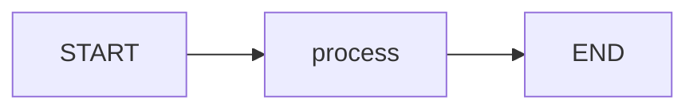
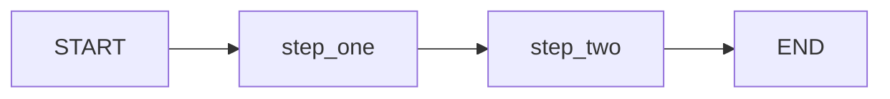
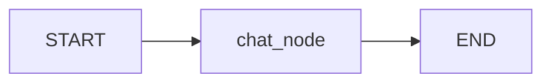
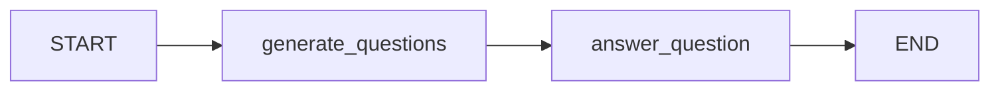

# `main.py` — beginner walkthrough (grave detail)

This file teaches **LangGraph** in four demos. A LangGraph app is a **flowchart**: you define shared **state** (a dict of fields), **nodes** (functions that read/update state), and **edges** (which node runs next). You then `.compile()` and `.invoke()` with starting values.

Mental model for every demo:

```text
initial state → node → partial update → merge into state → next node → … → final state
```

---

## File map (what each chunk does)

| Lines | What it is |
|-------|------------|
| 1–9 | Imports + load API keys from `.env` |
| 12–35 | Demo 1: simplest graph (uppercase a string) |
| 41–67 | Demo 2: state with **reducers** (lists/ints accumulate) |
| 73–97 | Demo 3: chat messages + LLM |
| 101–155 | Demo 4: exercise (topic → questions → answer) |
| 158–169 | `__main__`: runs all four demos when you `python main.py` |

---

## Imports & setup (lines 1–9)

### 1. One-liner
Pull in the tools this file needs, then load secrets (like `OPENAI_API_KEY`) from a `.env` file into the environment.

### 2. Inputs → Outputs

- **When defined / run at import time:**
  - `load_dotenv()` → reads `.env` → env vars become available to the LLM client later
- **Nothing is “invoked” yet** — these lines only prepare names you will use below

### 3. Data flow

1. Python loads each library.
2. `load_dotenv()` looks for `.env` in the project folder.
3. Keys like `OPENAI_API_KEY` become readable by later code (`init_chat_model`).
4. Demos that call an LLM can now authenticate without hard-coding secrets in the source.

### 4. Weird syntax only

- **`import operator`** — later used as `operator.add` (the normal `+` function) for reducers
- **`Annotated[...]`** — attaches extra metadata to a type (here: “how to merge updates”)
- **`TypedDict`** — a dict with named keys and types (like a schema for state)
- **`init_chat_model(...)`** — LangChain helper that builds a chat LLM from a model name
- **`BaseMessage` / `HumanMessage`** — chat message objects (user vs generic message)
- **`StateGraph`, `START`, `END`, `add_messages`** — LangGraph building blocks
- **`load_dotenv()`** — no arguments; side effect is loading env vars

### 5. Filled mini-example

If `.env` contains `OPENAI_API_KEY=sk-...`, after `load_dotenv()` any library that reads `os.environ["OPENAI_API_KEY"]` can find it. Your code never prints the key.

### 6. Not happening yet
No graph runs. No API call. Only imports and env loading.

---

## Demo 1 — Simple graph (`SimpleState` + `demo_simple_graph`)

### 1. One-liner
A tiny flowchart: take `input`, uppercase it into `output`, bump `step` by 1, then stop.

### 2. Inputs → Outputs

**State schema (`SimpleState`):**

| Key | Type | Meaning |
|-----|------|---------|
| `input` | `str` | starting text |
| `output` | `str` | result after processing |
| `step` | `int` | how many steps ran |

**When defined:**

- Creates a compiled graph `app` (a runnable program)

**When invoked:**

- **In:** `{"input": "hello", "step": 0}`
- **Out:** full final state, e.g. `{"input": "hello", "output": "HELLO", "step": 1}`

**Node `process`:**

- **In:** current state dict
- **Out:** a *partial* update `{"output": ..., "step": ...}` (not the whole state)

### 3. Data flow

1. You define `SimpleState` — the shape of the shared clipboard.
2. `process(state)` reads `state["input"]` and `state["step"]`.
3. It returns only the fields it wants to change.
4. LangGraph merges that update into state (default: **replace** those keys).
5. Edges say: `START → process → END`.
6. `app.invoke(...)` runs the path once and returns the final clipboard.



### 4. Weird syntax only

- **`class SimpleState(TypedDict):`** — declares state keys; values are a normal dict at runtime
- **`def process(state: SimpleState) -> dict:`** — a **node**: function in, partial state out
- **`StateGraph(SimpleState)`** — “build a graph whose clipboard looks like `SimpleState`”
- **`.add_node(process)`** — registers the function; node name defaults to `"process"`
- **`.add_edge(START, "process")`** — entry: always begin at `process`
- **`.add_edge("process", END)`** — after `process`, finish
- **`.compile()`** — freezes the design into something you can `.invoke()`
- **Fluent chain** — each method returns the graph, so you can stack calls in `(...)`

### 5. Filled mini-example

```python
# You pass:
{"input": "hello", "step": 0}

# process sees:
#   state["input"] == "hello"
#   state["step"] == 0
# and returns:
{"output": "HELLO", "step": 1}

# Final state (input untouched because process didn't return it):
{"input": "hello", "output": "HELLO", "step": 1}
```

### 6. Not happening yet
No LLM. Pure string/int logic. Just proving “state in → node → state out.”

---

## Demo 2 — Accumulating state / reducers (`AccumulatingState`)

### 1. One-liner
Same idea as Demo 1, but when two nodes write to the same key, values **combine** (list append / number add) instead of overwrite.

### 2. Inputs → Outputs

**State schema:**

| Key | Annotated with | Merge rule |
|-----|----------------|------------|
| `messages` | `operator.add` | old list + new list |
| `count` | `operator.add` | old int + new int |

**When invoked:**

- **In:** `{"messages": ["Initial message"], "count": 0}`
- **Out:** something like:
  - `messages`: `["Initial message", "Step 1 executed", "Step 2 executed"]`
  - `count`: `2` (0 + 1 + 1)

**Each node still returns a partial update**, e.g. `{"messages": ["Step 1 executed"], "count": 1}`.

### 3. Data flow

1. Start state: messages = `["Initial message"]`, count = `0`.
2. `step_one` returns `messages=["Step 1 executed"]`, `count=1`.
3. Reducer merges: `["Initial message"] + ["Step 1 executed"]`, and `0 + 1`.
4. `step_two` returns another message and `count=1`.
5. Reducer merges again: previous list + new item, and `1 + 1 → 2`.
6. Graph ends; print the accumulated lists/count.



Conceptual merge (from LangGraph docs):

```text
new_value = reducer(left=current_state[key], right=node_update[key])
# for operator.add on lists: left + right
# for operator.add on ints:  left + right
```

### 4. Weird syntax only

- **`Annotated[list[str], operator.add]`** — type is `list[str]`; merge function is `+`
- **`Annotated[int, operator.add]`** — same idea for numbers (sum updates)
- **Without a reducer**, returning `{"messages": [...]}` would **replace** the whole list
- **With a reducer**, returning a small list **appends** to the existing one
- Two nodes in a row: `START → step_one → step_two → END`

### 5. Filled mini-example

| After | `messages` | `count` |
|-------|------------|---------|
| invoke start | `["Initial message"]` | `0` |
| after `step_one` | `["Initial message", "Step 1 executed"]` | `1` |
| after `step_two` | `["Initial message", "Step 1 executed", "Step 2 executed"]` | `2` |

If there were **no** reducers and `step_two` returned `{"messages": ["Step 2 executed"]}`, you would **lose** earlier messages (overwrite). Reducers prevent that.

### 6. Not happening yet
Still no LLM. This demo is only about **how state merges**.

---

## Demo 3 — Message state + LLM (`MessageState` + `demo_message_state`)

### 1. One-liner
A one-node chat graph: put a user message in state, call GPT, append the AI reply using LangGraph’s special `add_messages` reducer.

### 2. Inputs → Outputs

**State:**

- `messages: Annotated[list[BaseMessage], add_messages]`
  - list of chat messages
  - merge with `add_messages` (append / smart-merge by message id; also accepts shorthand formats)

**When defined:**

- Builds `llm` (chat model `"gpt-4o-mini"`, `temperature=0`)
- Builds compiled `app`

**Node `chat_node`:**

- **In:** `state["messages"]` (conversation so far)
- **Out:** `{"messages": [response]}` where `response` is an AI message from the model

**When invoked:**

- **In:** `{"messages": [HumanMessage(content="Say Hello in Tagalog")]}`
- **Out:** same list **plus** the AI’s reply message

### 3. Data flow

1. `init_chat_model(...)` creates an LLM client (uses env API key).
2. Invoke starts with one `HumanMessage`.
3. `chat_node` calls `llm.invoke(state["messages"])`.
4. Model returns an AI message (e.g. “Kumusta” / “Hello” in Tagalog).
5. Node returns `{"messages": [response]}`.
6. `add_messages` merges that into the existing list (human + AI).
7. Print loop labels each message Human vs AI.



### 4. Weird syntax only

- **`add_messages`** — preferred reducer for chat history (better than plain `operator.add` for messages; can update by id and deserialize dicts into message objects)
- **`HumanMessage(content="...")`** — a user turn the model can read
- **`llm.invoke(messages)`** — **in:** list of messages → **out:** one AI message
- **`temperature=0`** — more deterministic answers (less random)
- **`isinstance(msg, HumanMessage)`** — used only for pretty printing roles

### 5. Filled mini-example

```python
# Start
messages = [HumanMessage(content="Say Hello in Tagalog")]

# After LLM (illustrative)
messages ≈ [
  HumanMessage(content="Say Hello in Tagalog"),
  AIMessage(content="Kumusta!"),  # actual text may vary
]
```

Printed roughly as:

```text
Human: Say Hello in Tagalog
AI: Kumusta!
```

### 6. Not happening yet
No multi-turn loop, no tools, no memory across separate `invoke` calls unless you pass the history back in yourself. One shot: one human message → one AI reply → done.

---

## Demo 4 — Exercise graph (`exercise_first_langgraph`)

### 1. One-liner
Two-step LLM pipeline: given a **topic**, node 1 generates **3 questions**, node 2 **answers the first question**, then return topic + questions + answer.

### 2. Inputs → Outputs

**State (`QAState`):**

| Key | Role |
|-----|------|
| `topic` | input subject |
| `questions` | text of the 3 questions (from node 1) |
| `answer` | text answering question 1 (from node 2) |

**No reducers here** — each field is written once (default replace is fine).

**When invoked:**

- **In:** `{"topic": "The future of renewable energy"}`
- **Out:** same topic + filled `questions` + filled `answer`

**Node I/O:**

| Node | Reads | Writes |
|------|-------|--------|
| `generate_questions` | `topic` | `questions` |
| `answer_question` | `questions` | `answer` |

### 3. Data flow

1. Start with only `topic` set.
2. `generate_questions` builds a `HumanMessage` prompt including the topic.
3. LLM returns text → stored in `questions`.
4. Edge moves to `answer_question`.
5. That node prompts: “Answer the first question from this list…” using `state["questions"]`.
6. LLM returns text → stored in `answer`.
7. `END` — print topic, questions, answer.



### 4. Weird syntax only

- **Nested `class QAState` inside the function** — state type only used by this exercise; keeps the demo self-contained
- **`llm.invoke([HumanMessage(...)])`** — even one prompt is a **list** of messages
- **f-strings** — insert `state['topic']` / `state['questions']` into the prompt text
- **`response.content`** — the plain text string inside the AI message object
- Return only the field you produced: `{"questions": ...}` or `{"answer": ...}`

### 5. Filled mini-example

```python
# Input
{"topic": "The future of renewable energy"}

# After generate_questions (shape of output, text varies):
{
  "topic": "The future of renewable energy",
  "questions": "1. ...?\n2. ...?\n3. ...?",
  "answer": ""  # may be missing until next node; after full run it's filled
}

# After answer_question:
{
  "topic": "The future of renewable energy",
  "questions": "1. ...?\n2. ...?\n3. ...?",
  "answer": ".... explanation of question 1 ...."
}
```

### 6. Not happening yet
Does not parse questions into a real list, does not answer all three, does not use tools/search — it just chains two LLM calls via graph edges.

---

## The runner (`if __name__ == "__main__":`)

### 1. One-liner
When you run `python main.py`, execute all four demos in order with section headers.

### 2. Inputs → Outputs

- **In:** none (no CLI args)
- **Out:** printed results from each demo (and LLM calls for demos 3–4)

### 3. Data flow

1. Python sets `__name__` to `"__main__"` for this file.
2. Prints banner for demo 1 → runs `demo_simple_graph()`.
3. Same for accumulating state, message+LLM, exercise.
4. Process exits when all prints finish.

### 4. Weird syntax only

- **`if __name__ == "__main__":`** — code here runs only when the file is executed directly, not when imported as a module

### 5. Filled mini-example

```bash
python main.py
```

You should see four sections: simple graph, accumulating state, message state, exercise.

### 6. Not happening yet
No tests, no web server, no interactive REPL — batch run of teaching demos.

---

## Cheat sheet: every important I/O in this file

| Piece | In | Out / effect |
|-------|----|--------------|
| `load_dotenv()` | `.env` on disk | Env vars available |
| Node function | Full current **state** | Partial **update** dict |
| Default merge (no reducer) | Update for a key | **Replace** that key |
| `Annotated[..., operator.add]` | Old value + update | **Sum / concatenate** |
| `Annotated[..., add_messages]` | Old messages + new | **Append/merge** chat messages |
| `StateGraph(Schema)` | Schema + nodes + edges | Builder |
| `.compile()` | Builder | Runnable `app` |
| `app.invoke(initial_state)` | Starting dict | Final state dict |
| `init_chat_model(...)` | Model name / settings | LLM client |
| `llm.invoke(messages)` | List of messages | AI message |
| `HumanMessage(content=...)` | String | User message object |

---

## How to read this file as a beginner

1. Read Demo 1 until “invoke → final state” feels obvious.
2. Read Demo 2 only for the **reducer** idea (why lists grow).
3. Read Demo 3 for **messages + LLM** inside a node.
4. Read Demo 4 as “two LLM nodes in a row,” reusing the same graph pattern.

Same pattern every time: **define state → write nodes that return updates → connect with edges → compile → invoke.**
