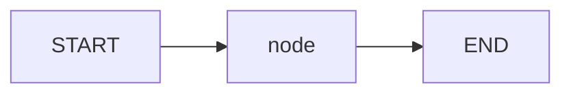
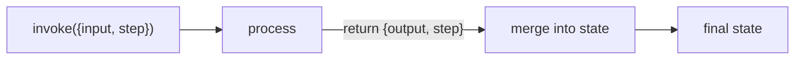
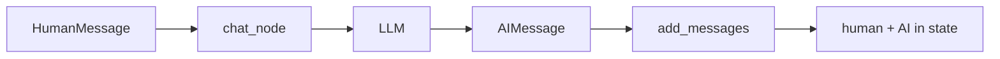

# Learning LangGraph (beginner guide)

This repo teaches the **smallest useful slice** of LangGraph. Read this while looking at [`main.py`](main.py). Run the file, then come back here for each demo.

## Setup

1. Create / activate a virtualenv (you may already have `.venv`).
2. Install deps from [`pyproject.toml`](pyproject.toml) (e.g. `uv sync` or `pip install -e .`).
3. Put your OpenAI key in `.env`:

```env
OPENAI_API_KEY=sk-...
```

4. Run:

```bash
python main.py
```

Demos 1–2 need **no** API key. Demos 3–4 call OpenAI.

---

## What LangGraph is

LangGraph runs a **graph**:

- **State** — a dict of data that travels through the graph
- **Nodes** — functions that read state and return updates
- **Edges** — which node runs next (`START` → … → `END`)

You define the graph, `.compile()` it into an app, then `.invoke(initial_state)`.



---

## 1. Simple graph — `demo_simple_graph`

**One-liner:** A one-node graph that uppercases `input` and bumps `step`.

### Inputs → Outputs

| When | In | Out |
|------|----|-----|
| **Defined** | `SimpleState` keys: `input`, `output`, `step` | A compiled app |
| **Invoked** | `{"input": "hello", "step": 0}` | Full state, e.g. `input` still `"hello"`, `output` `"HELLO"`, `step` `1` |

### Data flow

1. `invoke` starts with your dict as state.
2. Edge `START → "process"` runs the `process` node.
3. Node returns **partial** updates: `{"output": ..., "step": ...}`.
4. LangGraph **merges** those into state (default: overwrite those keys).
5. Edge `"process" → END` stops. You get the final state dict.



### Weird syntax only

- **`TypedDict`** — describes state keys/types (like a typed dict schema).
- **`StateGraph(SimpleState)`** — “this graph’s state looks like `SimpleState`.”
- **`.add_node(process)`** — registers the function; node name defaults to `"process"`.
- **`START` / `END`** — special entry/exit points, not your functions.
- **`.compile()`** — freezes the graph into something you can `.invoke()`.
- **Node return value** — a **partial** dict. Keys you omit stay as they were.

### Filled mini-example

Start: `{"input": "hello", "step": 0}` (no `output` yet).

`process` returns `{"output": "HELLO", "step": 1}`.

Final: `{"input": "hello", "output": "HELLO", "step": 1}`.

### Not happening yet

No LLM, no chat history, no “append” logic — just overwrite merge.

---

## 2. Reducers — `demo_accumulating_state`

**One-liner:** Same idea as demo 1, but some keys **append/sum** instead of replace.

### Inputs → Outputs

| When | In | Out |
|------|----|-----|
| **Defined** | `messages: Annotated[list[str], operator.add]`, `count: Annotated[int, operator.add]` | Compiled app |
| **Invoked** | `{"messages": ["Initial message"], "count": 0}` | `messages` has 3 strings; `count` is `2` |

### Data flow

1. Start: `messages=["Initial message"]`, `count=0`.
2. `step_one` returns `{"messages": ["Step 1 executed"], "count": 1}`.
3. Reducer runs: `old + new` → messages become 2 items; count becomes `1`.
4. `step_two` returns another message and `count: 1`.
5. Reducer again → 3 messages; count `2`.

Formula LangGraph uses:

```text
new_value = reducer(current_state[key], node_update[key])
```

For `operator.add`: lists concatenate, ints sum.

### Weird syntax only

- **`Annotated[list[str], operator.add]`** — “this field uses `operator.add` as its **reducer**.”
- **Without a reducer** — returning `{"messages": ["x"]}` would **replace** the whole list.
- **With `operator.add`** — returning `{"messages": ["x"]}` **appends** `["x"]` to the existing list.
- Two nodes in a row (`step_one` → `step_two`) shows updates stacking across steps.

### Filled mini-example

| After | `messages` | `count` |
|-------|------------|---------|
| Start | `["Initial message"]` | `0` |
| After step_one | `["Initial message", "Step 1 executed"]` | `1` |
| After step_two | `+ "Step 2 executed"` | `2` |

### Not happening yet

Still no LLM. Reducers are about **how state merges**, not about AI.

---

## 3. Message state + LLM — `demo_message_state`

**One-liner:** Chat-style state: a list of messages, plus one node that calls the model and appends the reply.

### Inputs → Outputs

| When | In | Out |
|------|----|-----|
| **Defined** | `messages: Annotated[list[BaseMessage], add_messages]` | Compiled app + an LLM |
| **Invoked** | `{"messages": [HumanMessage("Say Hello in Tagalog")]}` | Same list **plus** the AI reply message |

### Data flow

1. You pass a list with one `HumanMessage`.
2. `chat_node` reads `state["messages"]` and calls `llm.invoke(...)`.
3. Node returns `{"messages": [response]}` (the AI message).
4. `add_messages` **appends** that reply onto the conversation list.
5. Print loop shows Human then AI.



### Weird syntax only

- **`HumanMessage` / AI reply** — chat objects with a `.content` string (and a role).
- **`add_messages`** — LangGraph’s message reducer. Prefer this over plain `operator.add` for chat: it appends **and** can update messages by id later.
- **`init_chat_model("gpt-4o-mini")`** — builds a chat model (needs `OPENAI_API_KEY`).
- Returning `{"messages": [response]}` does **not** wipe history; the reducer merges.

### Filled mini-example

Invoke with: “Say Hello in Tagalog”.

Final `messages` roughly:

1. Human: `Say Hello in Tagalog`
2. AI: `Kamusta` (or similar)

### Not happening yet

No tools, no loops, no memory across separate `invoke` calls — one shot chat graph.

---

## 4. Exercise — `exercise_first_langgraph`

**One-liner:** Two LLM nodes in a pipeline: topic → questions → answer.

### Inputs → Outputs

| When | In | Out |
|------|----|-----|
| **Defined** | `QAState`: `topic`, `questions`, `answer` | Compiled two-node app |
| **Invoked** | `{"topic": "The future of renewable energy"}` | Same + filled `questions` and `answer` strings |

### Data flow

1. `START → generate_questions` — LLM writes 3 questions into `questions`.
2. `generate_questions → answer_question` — LLM reads those questions, answers the first into `answer`.
3. `answer_question → END`.

No special reducer here: each key is a plain string, so returns **overwrite** that field (fine for one write per key).

### Weird syntax only

- Same `StateGraph` / `add_node` / `add_edge` / `compile` / `invoke` pattern as demo 1.
- Each node still returns a **partial** update (`{"questions": ...}` or `{"answer": ...}`).
- Prompts are wrapped in `HumanMessage(...)` like demo 3.

### Try it

Change the topic in `app.invoke({"topic": "..."})` and re-run. Or comment out other demos in `__main__` if you only want this one.

### Not happening yet

No branching (“if bad answer, try again”), no tools, no saved memory between runs.

---

## Tiny glossary

| Term | Meaning |
|------|---------|
| **State** | The dict of data the graph carries |
| **Node** | A function: `state` in → partial update dict out |
| **Edge** | Connection: which node runs next |
| **`START` / `END`** | Entry and exit of the graph |
| **`compile()`** | Turn the builder into a runnable app |
| **`invoke(...)`** | Run the graph once with initial state |
| **Reducer** | Rule for merging a node’s update into an existing state key |

---

## What’s next (later)

When these four feel clear, learn:

1. **Conditional edges** — branch based on state (e.g. “call a tool or stop”)
2. **Tools / agents** — LLM chooses actions in a loop
3. **Checkpoints / memory** — resume or remember across turns

You do **not** need those to understand [`main.py`](main.py).
